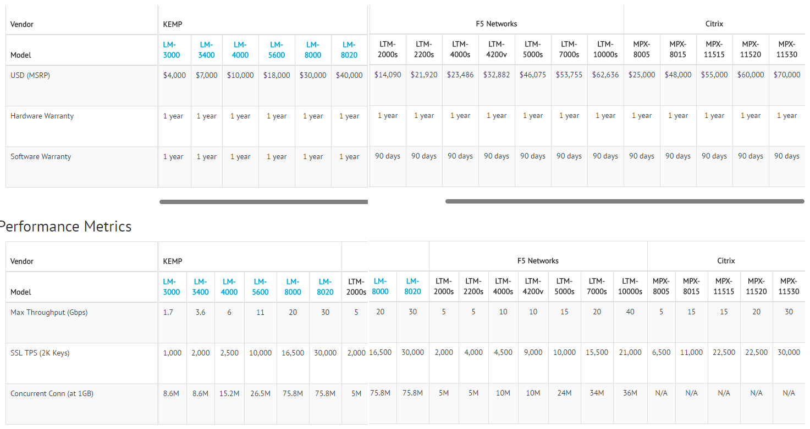

## Ejercicio T4.2:
#### Buscar información sobre precio y características de balanceadores hardware específicos. Compara lasprestaciones que ofrecen unos y otros.
Los balanceadores elegidos son KEMP LoadMaster, F5 - Big IP y Citrix Netscaler. La siguiente tabla muestra una comparación de sus precios y rendimiento.   
  
  
  
## Ejercicio T4.3:
#### Buscar información sobre los métodos de balanceo que implementan los dispositivos recogidos en el ejercicio 4.2.
Los algoritmos usados por KEMP LoadMaster son los siguientes:  
  
- Round Robin
- Weighted round robin
- Least connection
- Weighted least connection
- Agent-Based Adaptive Balancing
- Fixed weighting
- Weighted response time
- Source IP hash  
  
Los algoritmos usados por F5 - BIG IP son los siguientes:  
  
- Round Robin
- Ratio
- Least connection
- Fastest
- Observed
- Predictive  
  
Por ultimo los algoritmos usados por Citrix Netscaler son:  
  
- Least connection
- Round robin
- Least response time
- Url hash
- Domain hash
- Destination IP hash
- Source IP hash
- Src IP Dest IP hash
- Call ID hash
- Src IP Src Port hash
- Least Band width
- Least Packets
- Custom load
- Token 
- LRTM
