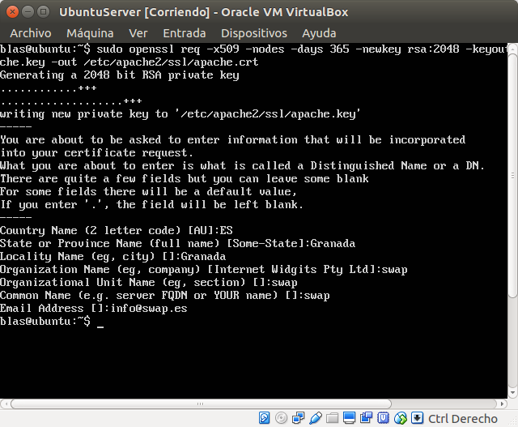
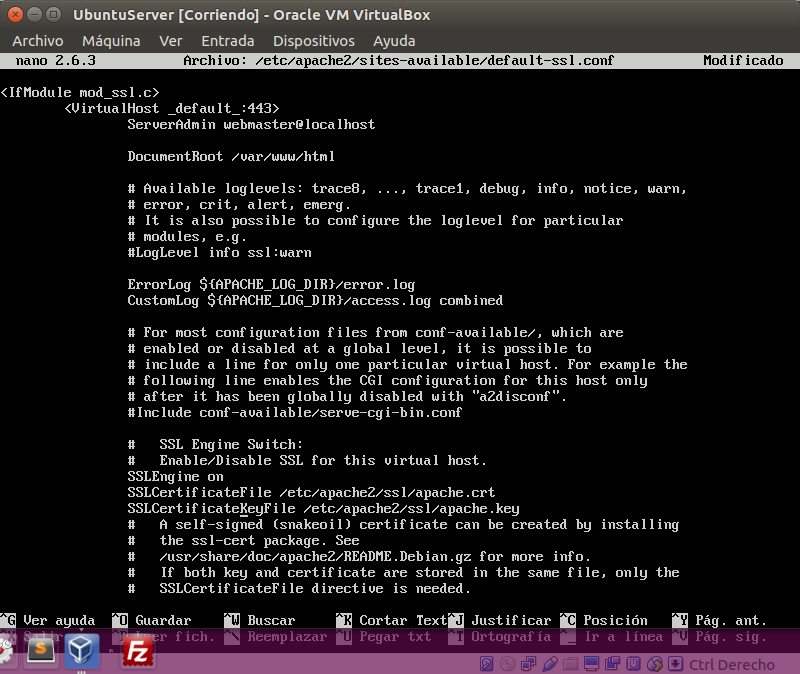
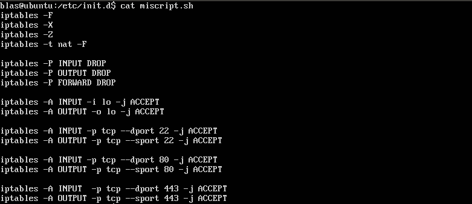
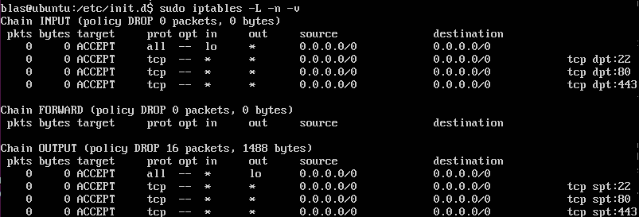

## 1. Instalar un certificado SSL autofirmado para configurar el acceso HTTPS a los servidores
Para realizar esto en primer lugar generaremos un certificado SSL autofirmado, para ello usaremos los siguiente comandos:  
  
  *a2enmod ssl*  
  *service apache2 restart*  
  *openssl req -x509 -nodes -days 365 -newkey rsa:2048 -keyout
 /etc/apache2/ssl/apache.key -out /etc/apache2/ssl/apache.crt*  
   
Al introducir el ultimo comando nos pedirá configurar el dominio tal y como se muestra en la siguiente imagen:  
  
  
A continuación modificaremos el archivo de configuración /etc/apache2/sites-available/default-ssl tal y como se muestra en la imagen:  
  
  
Comprobaremos que https esta activado haciendo una petición con curl desde otra de las maquinas:  
  
  
Como podemos ver curl no nos deja conectarnos al esta el certificado autofirmado, debemos usar la opción -k  
para poder realizar la petición.
  
## 2. Configurar las reglas del cortafuegos con IPTABLES y realizar un script para ello.  
En primer lugar crearemos el script.  
  
  
Al comienzo del mismo eliminamos las reglas que tengamos por defecto y a continuación abrimos los diferentes puertos, que serán  
el 22, el 80 y el 443.  
  
A continuación haremos que el script se ejecute al inicio del sistema, para ello en primer lugar copiaremos el script a  
/etc/init.d/ y una vez ahí ejecutaremos el comando *sudo update-rc.d miscript.sh defaults*.  
  
  
  
  
Tras hacer esto reiniciaremos el sistema y comprobaremos los puertos que se encuentran abiertos.  
  
  
Como podemos ver tan solo se encuentran abiertos los puertos que habíamos especificado en el script anteriormente.
