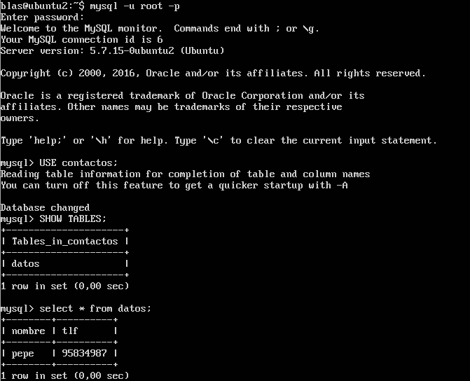

## 1. Crear BD con al menos una tabla y algunos datos, realizar la copia de seguridad e importarla a la máquina esclavo.
Crearemos la base de datos en la máquina 1 y en la máquina 2, a continuación crearemos las tablas en la máquina 1 y crearemos 
un archivo sql mediante *mysqldump ejemplodb -u root -p > /tmp/ejemplodb.sql*, una vez hecho esto lo importaremos en la base 
de datos de la máquina 2 copiando antes el archivo sql mediante *scp maquina1:/tmp/ejemplodb.sql /tmp/*.  
  
  
  
Podemos ver como se han creado las tablas en la maquina 2 mediante el archivo sql en la siguiente imagen.  
  
  
  
## 2. Realizar la configuración maestro-esclavo de los servidores MySQL para que la replicación de los datos se realice automáticamente.
En primer lugar configuraremos la máquina maestro, para ello editaremos /etc/mysql/my.cnf comentado el parámetro *bind-address 127.0.0.1*, 
estableciendo *server_id=1*, *log_error = /var/log/mysql/error.log* y *log_bin = /var/log/mysql/bin.log*.  
  
La configuración del esclavo sera igual pero en la id del servidor sera 2.  
  
A continuación crearemos el usuario que sera usado por la máquina esclavo, para ello ejecutaremos los siguientes comandos mostrados en 
la imagen y a continuación mostraremos los datos del maestro necesarios para realizar la replicación.  
  
  
  
Cambiaremos el maestro de la máquina esclavo y reiniciaremos mysql.  
  
  
  
A continuación veremos el estado del esclavo.  
  
  
  
No muestra ningún mensaje de error y *Seconds_Behind_Master* se encuentra a 0 con lo que procedemos a crear una tabla en la máquina 1
para ver si se replica.  
  
  
  
Vemos que la replicación se realiza con éxito.
