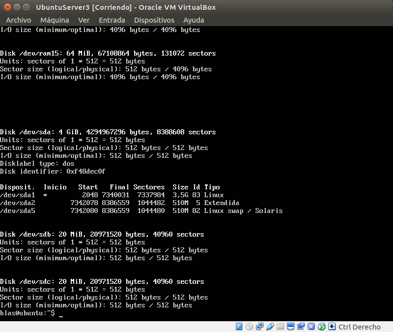
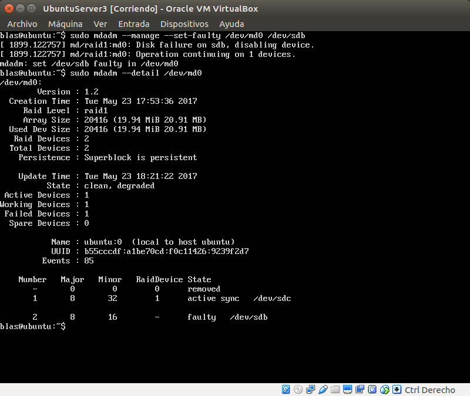
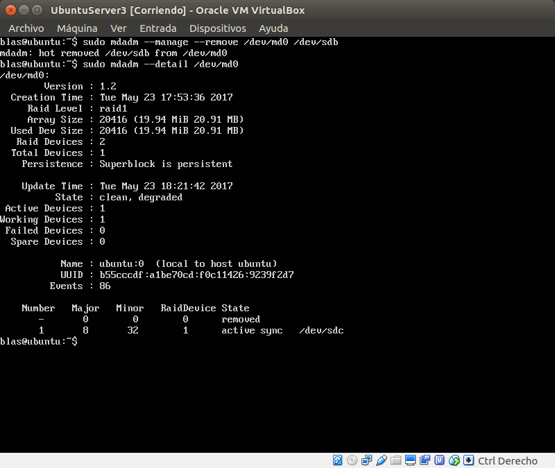
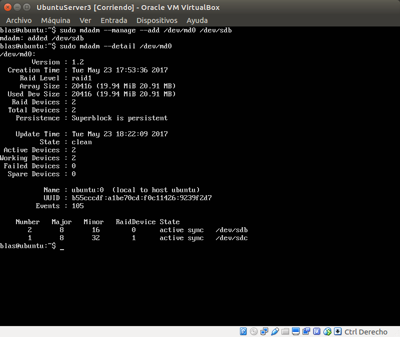

## 1. realizar la configuración de dos discos en RAID 1 bajo Ubuntu, automatizando el montaje del dispositivo creado al inicio del sistema.
Usamos los comandos proporcionados para montar los discos, en la siguiente imagen vemos los discos ya montados. 
  
  
 
## 2. Simular un fallo en uno de los discos del RAID (mediante comandos con el mdadm), retirarlo “en caliente”, comprobar que se puede acceder a la información que hay almacenada en el RAID, y por último, añadirlo al conjunto y comprobar que se reconstruye correctamente.
Simulamos un fallo en uno de los discos. 
  
  
 
Quitamos el disco que ha fallado en caliente.  
  
  
  
Añadimos el disco de nuevo, una vez mas en caliente.
  
  

